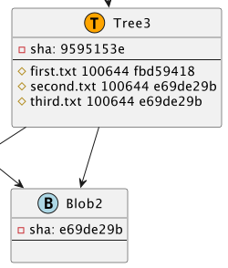

# git2plantuml

Git2PlantUML is a tool that reads git repository commits and renders them as PlantUML diagrams.

If you are studying or teaching git, this tool can be extremely useful for you to demo internals of git structures.

---

Check out my posts about internal git structures (git2plantuml used to visualize data):
- [How actually git tracks objects. Snapshotting and the Illusion of git Diff.](https://tsypuk.github.io/posts/git-diff-illusion/)
- [Git branches, where do they lead ?](https://tsypuk.github.io/posts/git-branches/)

---

## Installation

```bash
./gradlew clean build

./gradlew run

> Task :run
[main] INFO io.github.tsypuk.App - HEAD3150d02c3ae03060a7614cee66c2466b4bc28614
[main] INFO io.github.tsypuk.App - refs/heads/main3150d02c3ae03060a7614cee66c2466b4bc28614

BUILD SUCCESSFUL in 1s
```

---

## Usage

The output of elements are fully configurable in the config.yaml file. You can customize based on you need amount of hash digits, branches, whether to show inner deep dive
git objects or commits only, group arrows to same object into single line, etc.

```yaml
repo-path: "/tmp/gitexplore"
result-file: "/tmp/result.plantuml"
show-branches: true
console-debug: false
plantuml-jekyll: false
show-tree-blob: true
single-arrow-tree: false
hash-limit: 8
resolve:
  - "main"
```

### repo-path: "/tmp/gitexplore"
Location of your git repo

### result-file: "/tmp/result.plantuml"
location of generated plantuml file (file will be overwritten/recreated)

### show-branches : true

branches are shown on top of commit


### console-debug : true
besides FileOutput, will also print to console generated format

``` shell
> Task :compileJava UP-TO-DATE
> Task :processResources UP-TO-DATE
> Task :classes UP-TO-DATE

> Task :GitUml.main()
++++
<center>
++++
[plantuml, 29fca3c4-735e-4ec6-a2cc-779c6ba99009, png, title="Git repository snapshot: 3 commits, 3 trees, 2 blobs, 2 refs: HEAD,refs/heads/main", width=1000, height=1000]
....
class Commit3 <<(C,orange)>> {
-sha: 3150d02c
--
message: added 3rd file

--
timestamp: 1677327539
}
class Commit2 <<(C,lightblue)>> {

```

### plantuml-jekyll : true
will generate one more file, wrapped with jekyll-specific headers

### show-tree-blob : true 

represents Commit, Tree, Blob objects. On false - Commit only


### single-arrow-tree : false

If there are multiple tree references to the same Blob will show as single connection




### hash-limit : 8

Default to 8. How many digits from sha will be included


### resolve :
list of branches (**master** or **main** is preferred)

## Example


---

## Contributing

Contributions are welcome!

---

## License

This project is licensed under the MIT License - see the [LICENSE](LICENSE) file for details.
